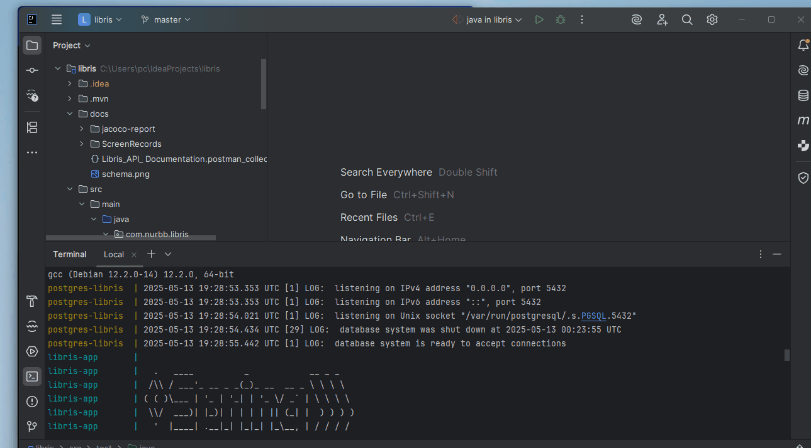
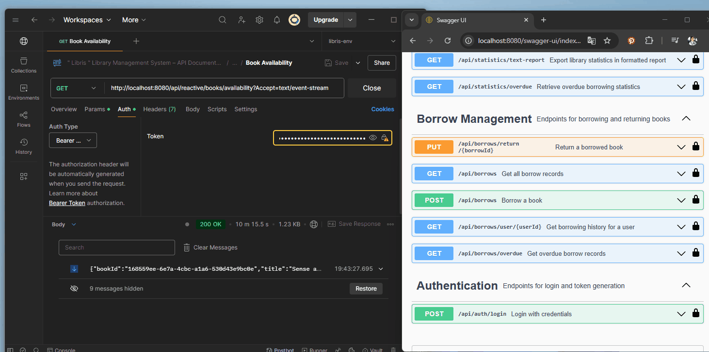
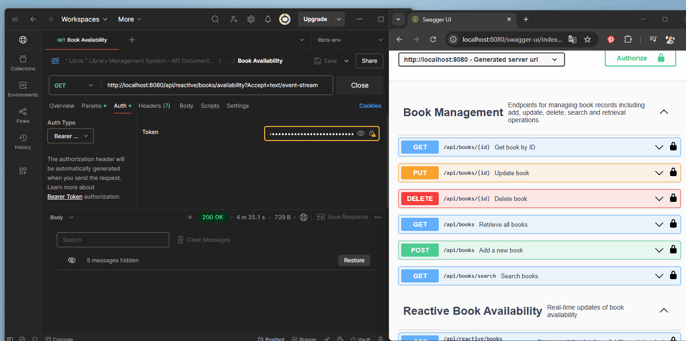
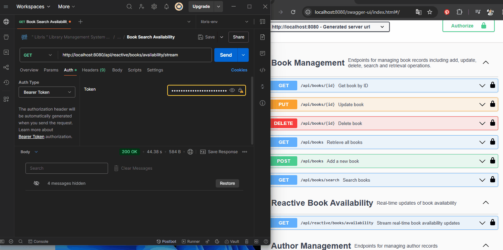
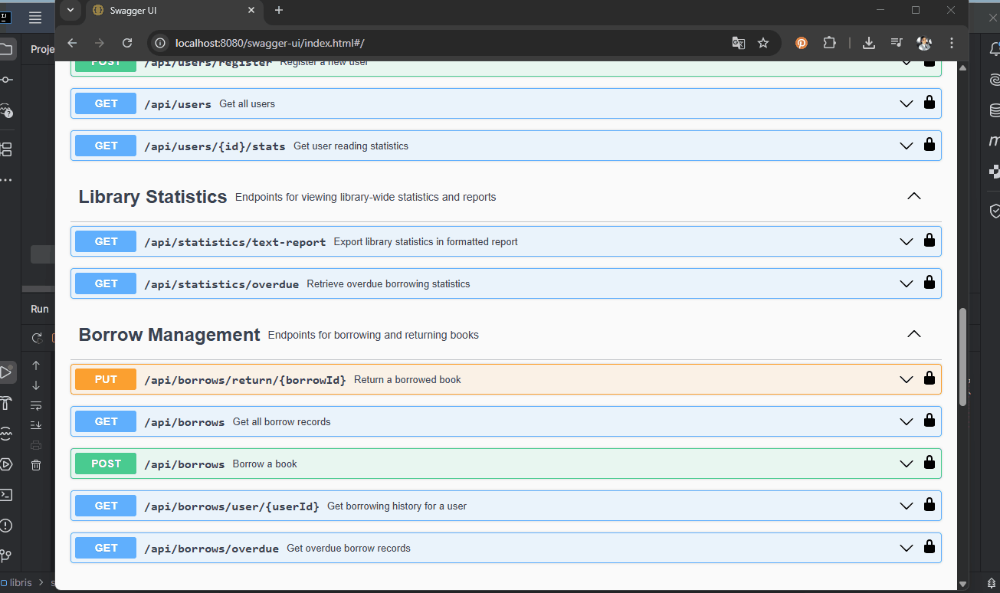
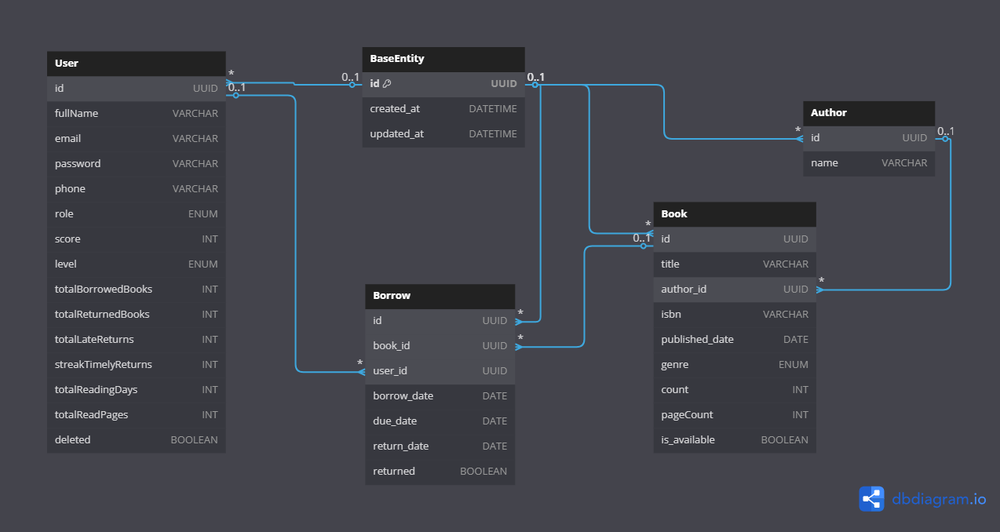

# 📚 LIBRIS - Library Management System

Libris is a full-featured library management system built with Spring Boot 3 and Java 21, developed for the **Patika.dev & Getir Java Spring Boot Bootcamp**. It offers RESTful APIs for managing books, users, borrow/return operations, and supports real-time features and scoring-based logic.

---

## 🔍 Features

### ✅ Core Features

- **Book Management**
    - Add, update, delete (soft delete), view, and search books by title, author, genre, ISBN
    - Pagination and case-insensitive search
- **User Management**
    - User registration and role-based control (GUEST, USER, LIBRARIAN)
    - CRUD operations for user data (with identity-based access rules)
- **Borrowing & Returning**
    - Borrow with due date and eligibility checks
    - Return tracking and overdue detection
    - Borrow history per user and global overdue reports
- **Authentication & Authorization**
    - Secure login/register using **Spring Security & JWT**
    - Role-based endpoint authorization
- **Documentation**
    - Fully documented with **Swagger/OpenAPI**
- **Logging**
    - Structured logging via **SLF4J + Logback**
    - Global exception handler with error detail logging
- **Testing**
    - **Unit & Integration Tests** using **JUnit + H2**
- **Postman Collection**
    - Includes all endpoint examples with test data

---

## 💎 Extra Features Implemented 

- ✅ **🧠 Dynamic Score & Level System**
    - Score-based classification (Novice → Bibliophile)
    - Rewards and penalties for user actions (early return, delay, loss, damage)
    - Borrowing rights and durations adapt based on level and score
- ✅ **📈 Statistics Dashboard**
    - Most borrowed books & genres
    - Overdue ratios
    - Monthly borrow trends
    - Average return durations
- ✅ **⚛️ Reactive Book Search**
    - Built using **Spring WebFlux**
    - Real-time availability stream with Observer Pattern
- ✅ **🔐 Identity Access Logic**
    - Users can only access/edit their own data
    - Librarians have advanced control
- ✅ **🗂️ Soft Delete**
    - Instead of permanent deletion, records are flagged to preserve data history
- ✅ **🪪 Role-Permission Matrix**
    - Clear boundaries of what each role can perform in the system
- ✅ **🐳 Dockerized Deployment**
    - Application and PostgreSQL containers with `docker-compose.yml`
- ✅ **Audit Fields**
    - All entities track `createdAt`, `updatedAt`, and `deleted` status

---

## 🛠️ Tech Stack

| Layer        | Technology                      |
|--------------|----------------------------------|
| Backend      | Java 21, Spring Boot 3           |
| Reactive     | Spring WebFlux                   |
| Security     | Spring Security + JWT            |
| Database     | PostgreSQL (R2DBC + JPA)         |
| In-Memory DB | H2 (testing)                     |
| Testing      | JUnit 5, Mockito, Spring Test    |
| Documentation| Swagger / OpenAPI 3              |
| Logging      | SLF4J, Logback                   |
| Container    | Docker, Docker Compose           |
| Build Tool   | Maven                            |

---

## 📦 Installation

### Prerequisites

- Java 21+
- PostgreSQL
- Maven
- Docker (Optional)


### Clone and Run

```bash
git clone https://github.com/yourusername/libris.git
cd libris
mvn clean install
mvn spring-boot:run
```

---

## ⚙️ Configuration

- `application.yml` is configured for:
  - PostgreSQL (`localhost:5432/libris`, user: `postgres`, pass: `12345`)
  - R2DBC + JPA in separate packages
  - JWT secret, expiration time
  - Swagger URL: `http://localhost:8080/swagger-ui/index.html`

---

## 🐳 Docker Usage

This project includes full Docker support for both the backend application and PostgreSQL database.

### 🧩 Requirements

- Docker
- Docker Compose

### 🧱 Services Overview

- **PostgreSQL Service**
  - Port: `5432`
  - Username: `postgres`
  - Password: `12345`
  - Database: `libris`

- **Spring Boot App**
  - Port: `8080`
  - Reads the jar file from `target/*.jar`
  - Uses environment variables defined in `docker-compose.yml`

### ▶️ Run the Application with Docker

1. First, package the application:

```bash
mvn clean package
```

2. Then start the containers:

```bash
docker-compose up --build
```

> Access the app at `http://localhost:8080`  
> Swagger UI: `http://localhost:8080/swagger-ui/index.html`

### 📁 Docker Files

```
.
├── Dockerfile
├── docker-compose.yml
├── target/libris.jar
```

---
## 📊 API Endpoints Summary

### Auth
| Endpoint         | Method | Roles Allowed | Description                       |
|------------------|--------|----------------|-----------------------------------|
| /api/auth/login  | POST   | GUEST          | Authenticate and get JWT token    |

### Author

| Endpoint              | Method | Roles Allowed | Description           |
|-----------------------|--------|----------------|-----------------------|
| /api/authors          | POST   | LIBRARIAN      | Add new author        |
| /api/authors          | GET    | ALL            | Get all authors       |
| /api/authors/{id}     | GET    | ALL            | Get author by ID      |
| /api/authors/{id}     | DELETE | LIBRARIAN      | Delete author by ID   |


### Book
| Endpoint             | Method | Roles Allowed             | Description                  |
|----------------------|--------|----------------------------|------------------------------|
| /api/books           | POST   | LIBRARIAN                  | Add a new book               |
| /api/books           | GET    | GUEST, PATRON, LIBRARIAN   | Retrieve all books           |
| /api/books/{id}      | GET    | ALL                        | Get book by ID               |
| /api/books/search    | GET    | ALL                        | Search books by query        |
| /api/books/{id}      | PUT    | LIBRARIAN                  | Update book                  |
| /api/books/{id}      | DELETE | LIBRARIAN                  | Delete book                  |


### User
| Endpoint               | Method | Roles Allowed      | Description                           |
|------------------------|--------|---------------------|---------------------------------------|
| /api/users/register    | POST   | GUEST               | Register a new user                   |
| /api/users/{id}        | GET    | LIBRARIAN, PATRON   | Get user by ID (self if patron)      |
| /api/users             | GET    | LIBRARIAN, PATRON   | Get all users or self                 |
| /api/users/{id}        | PUT    | LIBRARIAN           | Update user by ID                     |
| /api/users/{id}        | DELETE | LIBRARIAN           | Delete user by ID                     |
| /api/users/{id}/stats  | GET    | LIBRARIAN, PATRON   | Get user reading statistics           |


### Borrow
| Endpoint                         | Method | Roles Allowed      | Description                    |
|----------------------------------|--------|---------------------|--------------------------------|
| /api/borrows                     | POST   | LIBRARIAN           | Borrow a book                  |
| /api/borrows/return/{borrowId}  | PUT    | LIBRARIAN, PATRON   | Return a book                  |
| /api/borrows/user/{userId}      | GET    | LIBRARIAN           | User borrow history            |
| /api/borrows                    | GET    | LIBRARIAN, PATRON   | Get all borrows (or own)       |
| /api/borrows/overdue           | GET    | LIBRARIAN           | Get overdue borrows            |

### Statistics
| Endpoint                     | Method | Roles Allowed | Description                    |
|------------------------------|--------|----------------|--------------------------------|
| /api/statistics/text-report | GET    | LIBRARIAN      | Get full statistics as text    |
| /api/statistics/overdue     | GET    | LIBRARIAN      | Get overdue statistics summary |

### Book Availability

| Endpoint                          | Method | Roles Allowed | Description                         |
|-----------------------------------|--------|----------------|-------------------------------------|
| /api/reactive/books/availability | GET    | ALL            | Stream book availability (SSE)     |


### Book Reactive

| Endpoint                                         | Method | Roles Allowed             | Description                      |
|--------------------------------------------------|--------|----------------------------|----------------------------------|
| /api/reactive/books/search                      | GET    | GUEST, PATRON, LIBRARIAN   | Search books reactively          |
| /api/reactive/books/availability/stream         | GET    | ALL                        | Stream book availability (SSE)   |


> See Swagger for full request/response details.

---

## 🛡️ Role-Permission Matrix

| Role       | Book Operations       | User Operations      | Borrow Operations      | Statistics Access  |
|------------|------------------------|-----------------------|------------------------|--------------------|
| GUEST      | View/Search            | ❌                    | ❌                      | ❌                  |
| USER       | View/Search            | View/Update Self      | Borrow/Return/View Own | ❌                  |
| LIBRARIAN  | Full CRUD              | Full CRUD             | View All / Overdue     | ✅                  |

> ✅ = full access, ❌ = no access

---
## 🔐 Authentication
  
JWT-based login and user authentication.

## ✍️ Author Management
  
Create, update, delete, and list authors.

## 📚 Book Management
  
Manage books: add, update, delete, and search.

## 🔁 Borrow & Return
  
Borrow and return books, and view history.

## 🐳 Docker Integration
  
Run the entire project using Docker containers.

## 🟣 Reactive Borrowing
  
Borrow books reactively using WebFlux.

## 🟣 Reactive Publisher
  
Publish new books reactively via WebFlux.

## 🔍 Reactive Search
  
Search books reactively by title, author, genre, etc.

## 📈 Statistics
  
Display most borrowed books, overdue ratio, and return time stats.

## ✅ Test Coverage
  
Showcase of successfully running unit and integration tests.

## 👤 User CRUD
  
Full user management: add, update, delete.

## 👥 User Operations
  
User views their profile and borrowing history.

--
## 🧪 Test Report

### ✅ Scope

All critical services and controllers have been tested through both unit and integration tests. The focus was on functional correctness, validation, exception handling, access control, and business logic.

### 🧪 Test Types

- **Unit Tests:** Focused on service-layer logic using JUnit + Mockito
- **Integration Tests:** Full-stack endpoint tests with real request-response flow using H2 in-memory DB

### 🧰 Tools & Environment

- JUnit 5
- Mockito
- Spring Boot Test
- H2 Database (for integration)
- Swagger UI (for manual test verification)

### ✔️ Tested Classes & Key Scenarios

#### 📚 `BookServiceImplTest`
- Search, get, update, and delete book operations
- Handles: not found, duplicate ISBN, no results, active borrows
- Logging verification and update-without-change check

#### 👤 `UserServiceImplTest`
- Register, update, delete, and statistics retrieval
- Validates: role-based restrictions, existence checks, active borrow constraints

#### 📖 `BorrowServiceImplTest`
- Borrow and return logic with all business rules
- Validates: late return, borrowing limits, book availability, duplicate borrows
- Score calculation and librarian-only actions

#### ✍️ `AuthorServiceImplTest`
- Create, fetch, update, and delete authors
- Handles: blank/null names, duplicates, cascade delete restrictions

---

### 🌐 Controller Integration Tests

#### `AuthControllerIntegrationTest`
- Login and registration flows with valid/invalid credentials

#### `BookControllerIntegrationTest`
- Full CRUD + search and creation tests with status code verification

#### `UserControllerIntegrationTest`
- Access control enforcement (403/404 cases)
- View/update/delete own data, librarian-only access

#### `BorrowControllerIntegrationTest`
- All borrow-return flows
- Tests for invalid input, duplicate operations, overdue listings

#### `StatisticsControllerIntegrationTest`
- Tests statistics endpoint access (valid data, unauthorized access, formatted responses)

#### `AuthorControllerIntegrationTest`
- Tests CRUD + validation for authors
- Ensures deletion restriction if books are assigned

#### `StatisticsServiceImplTest`
- Business logic tests for overdue ratio and borrowing statistics map

---

### 🔁 Execution

- All tests run using:
```
bash
mvn test
```

---

## 📊 Test Coverage

Test coverage is measured using **JaCoCo** and includes both unit and integration tests.

### ✅ Coverage Summary

- **Instruction Coverage:** 90%
- **Controller Coverage:** 95%
- **Service Layer Coverage:** ~93%
- **Branch Coverage:** 68%
- **Security & Config Classes:** 97% – 100%
- **DTOs / Enums / Value Objects:** 100%

> All critical business logic — such as borrowing rules, score system, access control — is covered.

### 📁 Report Location

The full report is available at:

```bash
/docs/jacoco-report/index.html
```

To generate the report locally:

```bash
mvn clean test jacoco:report
```

Then open:

```
target/site/jacoco/index.html
```

To include it in documentation:

```bash
mkdir -p docs/jacoco-report
cp -r target/site/jacoco/index.html target/site/jacoco/jacoco-sessions.html docs/jacoco-report/
```

> The report includes clickable views of all packages, classes, and methods.
 
--

## 🔄 Postman Collection

[](https://www.postman.com/nurbulbul/workspace/my-workspace/collection/29027015-e0f3c9f6-96ce-45b7-b904-9fea8996e4d6?action=share&creator=29027015&active-environment=29027015-ad0880b6-b628-43b0-bda7-81f54b310111)

🟢 Pre-configured Postman collection provided under:

```bash
/postman/libris-collection.json
```

Includes grouped folders for:

- Auth
- Books
- Users
- Borrow
- Statistics

---

## 📌 Database Schema

- `User` ⟶ `Borrow` (1-to-many)
- `Book` ⟶ `Borrow` (1-to-many)
- `Author` ⟶ `Book` (1-to-many)
- `Genre`: Enum
- `Level`: Enum (`NOVICE`, `READER`, `BOOKWORM`, `BIBLIOPHILE`)



---

## 📎 License

This project is for educational purposes only and is not licensed for commercial use.
